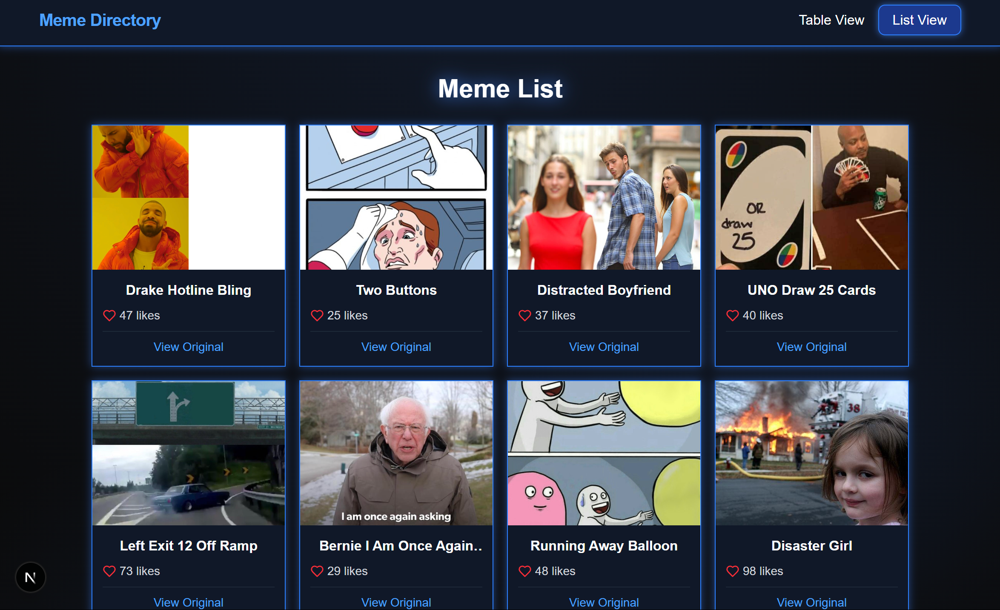

#  <a href="https://reactjs.org/" target="_blank" rel="noreferrer">   

# TOP-MEM-APP

### [Site link] https://top-memes-app-production.up.railway.app/list)

### Author

- Volodymyr Babiichuk - https://volodymyrcodepro.online/
